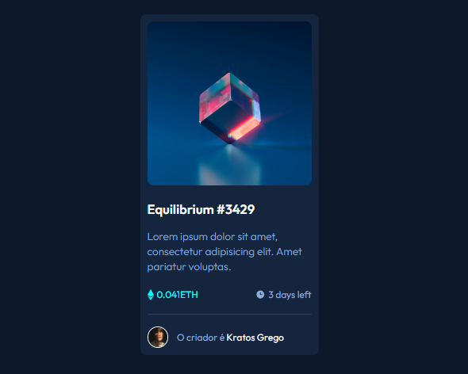

<h1 align="center">Cartão de visualização NFT 💳<h3>

    

NFT é a representação de um item exclusivo, que pode ser digital ou física, a exemplo de um quadro. Além de obras de artes, músicas, itens de jogos, momentos únicos no esporte e memes podem ser transformados em um.

O projeto foi baseado em um desafio do site frontendmentor.com,  um dos melhores sites para praticar as técnicas de Html, Css e Js.

 
 <h2>🕹️ Tecnologias Utilizadas</h2>
    <ul align="center">
        
        
    </ul> 

<h2 align="center">🔗 Link da página</h2>

Logo abaixo temos o link da página para visualização ou testes:

👉 <a href="https://oseiasweb.github.io/cartao-nft/" target="_blank">Cartão NFT</a>  

<h2 align="center">🏆 Status Projeto</h2>

 

